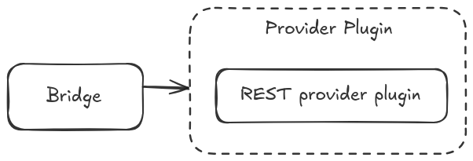
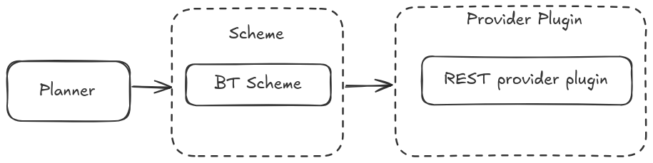

# Prompt Tools

[](https://index.ros.org/doc/ros2/Releases/)
[](https://index.ros.org/doc/ros2/Releases/)
[](./LICENSE)
[](https://open.vscode.dev/airesearchlab/prompt_tools)
<!-- [](https://doi.org/10.1/zenodo.1) -->

ROS2 meta-package with tools for working with prompted systems such as large language models and their responses in a distributed data driven robotic system application (ROS) including generic ROS message types for LLM prompts.

This package contains one main component;

- [prompt_bridge](./prompt_bridge/readme.md)

### Entities

| Entity | Package | Description |
| --- | --- | --- |
| [Providers](./prompt_provider/readme.md) | prompt_provider | The interface that connects bridge with the LLM. Implemented as a plugin |
| [Schemes](./prompt_scheme/readme.md) | prompt_scheme | Additional rule-sets to augments the prompts |

## Prompt Bridge

The main system that connects ROS2 data and a LLM. Utilizes Provider plugins for connection interfaces.



## Prompt Planner (experimental)

The system that connects ROS2 data and a LLM. Utilizes Schemes to introduce additional rulesets to augment the prompts and responses. Also utilizes Provider plugins for connection interfaces.



## Install

### Clone packages

Clone the prompt tools package.

```bash
cd src
git clone https://github.com/CollaborativeRoboticsLab/prompt_tools.git -b develop
```

### Dependency Installation

Move to workspace root and run the following command to install dependencies

```bash
cd ..
rosdep install --from-paths src --ignore-src -r -y
```

## Usage

### Using Proxy LLM

If not connecting to a Online API, a local LLM running on docker can be used. Separately clone a repository such as [CollaborativeRoboticsLab/ollama-docker](https://github.com/CollaborativeRoboticsLab/ollama-docker) for this purpose and start it.

### Using OpenAI api

Run the following command with the actual `OPENAI_API_KEY` in place of `<open-ai-api-key>`

```bash
export PROMPT_PROVIDER_API_KEY="<open-ai-api-key>"
```

and then update the config file with the correct api endpoints and model names and run,

```bash
colcon build
```

### Start the Prompt Bridge

```bash
source install/setup.bash
ros2 launch prompt_bridge prompt_bridge.launch.py
```
