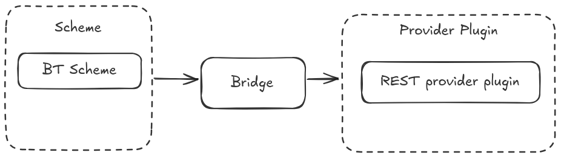

# Prompt Tools

[](https://index.ros.org/doc/ros2/Releases/)
[](https://index.ros.org/doc/ros2/Releases/)
[](./LICENSE)
[](https://open.vscode.dev/airesearchlab/prompt_tools)
<!-- [](https://doi.org/10.1/zenodo.1) -->

ROS2 meta-package with tools for working with prompted systems such as large language models and their responses in a distributed data driven robotic system application (ROS) including generic ROS message types for LLM prompts.

## Entities

| Entity | Package | Description |
| --- | --- | --- |
| [Bridge](./prompt_bridge/readme.md) | prompt_bridge | The main connection that connects ROS2 data and a LLM |
| [Provider Plugins](./prompt_provider_plugins/readme.md) | prompt_provider_plugin | The interface that connects bridge with the LLM. Implemented as a plugin |
| [Schemes](./prompt_schemes/readme.md) | prompt_scheme | The interface that connects ROS2 with the bridge. Implemented as a plugin. |

## System Structure



## Install

### Clone packages

Clone the prompt tools package.

```bash
cd src
git clone https://github.com/CollaborativeRoboticsLab/prompt_tools.git -b develop
```

### Dependency Installation

Move to workspace root and run the following command to install dependencies

```bash
cd ..
rosdep install --from-paths src --ignore-src -r -y
```

## Usage

### Start the Prompt Tools stack

```bash
source install/setup.bash
ros2 launch prompt_bridge prompt_bridge.launch.py
```

## Citation

If you use this work in an academic context, please cite the following publication(s):

```bibtex
@inproceedings{,
  title={A Framework for Integrating Large Language Models in Distributed Robotic Applications},
  author={},
  booktitle={},
  pages={},
  year={2023}
}
```
