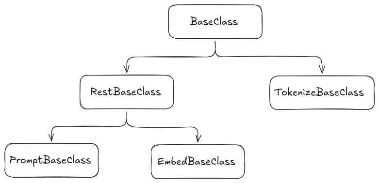

# Class Structure

This document provides an overview of the main classes and their relationships in the `prompt_base` package. The package is designed to provide base classes and utilities for prompt handling, embedding, REST interfaces, and tokenization.

## Main Classes

### 1. BaseClass

Defines the common plugin interface. Derived classes override `initialize()` and one or more of `sendPrompt()`, `sendConversation()`, `get_embeddings()`, or `get_tokens()` depending on the capability they implement.

### 2. RestBaseClass

Inherits from `BaseClass` and provides common REST transport behavior: parameter loading, optional API-key lookup from environment variables, default option loading, HTTP request dispatch, and JSON error extraction.

### 3. PromptBaseClass

Inherits from `RestBaseClass` and provides the prompt-specific REST flow. Derived classes implement JSON conversion for one-shot prompts and conversation prompts plus response parsing.

### 4. EmbedBaseClass

Inherits from `RestBaseClass` and provides the embedding-specific REST flow. Derived classes implement request serialization and response parsing for embedding providers.

### 5. TokenizeBaseClass

Inherits from `BaseClass` and provides the tokenization interface. The current bundled implementation uses local software through `cpp-tiktoken`, but other implementations can provide different local or remote tokenization behavior.

## Utilities

Located in `include/prompt_base/utils/`, these headers provide supporting structures and functions:

- `conversions.hpp`: Utility functions for converting between ROS messages and the internal request and response structs.
- `exceptions.hpp`: Custom exception classes for error handling in prompt operations.
- `prompt_options.hpp`: Functions for loading default option values from ROS parameters and merging them into request options.
- `structs.hpp`: Common data structures used across the base classes.

## Relationships

- `PromptBaseClass` and `EmbedBaseClass` inherit from `RestBaseClass`.
- `TokenizeBaseClass` inherits directly from `BaseClass`.
- All plugin classes loaded by `prompt_bridge` are exported against the same `prompt::BaseClass` pluginlib base.
- Utility headers are included as needed to support functionality in the main classes.

## Extensibility

The package is designed for extensibility, allowing developers to implement custom prompt providers, embedders, REST services, and tokenizers by inheriting from these base classes and overriding their virtual methods.