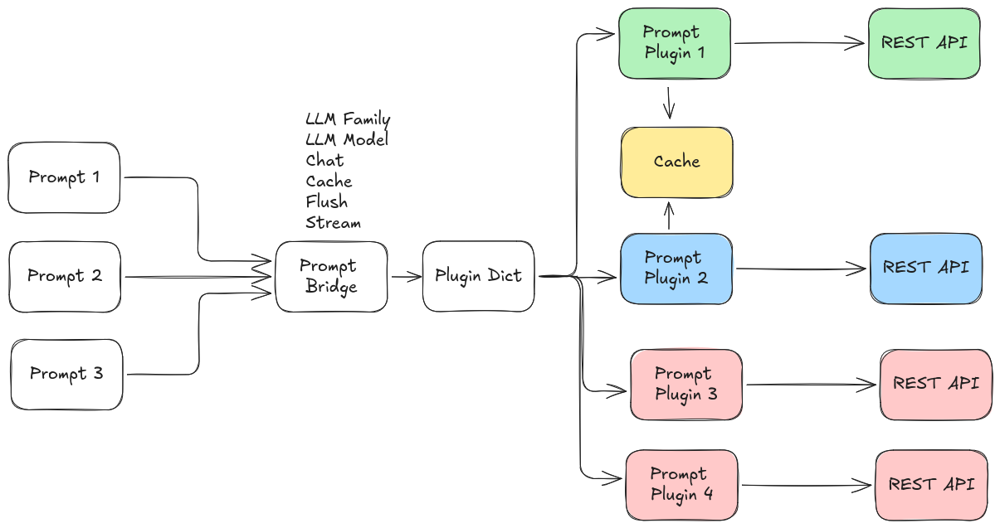
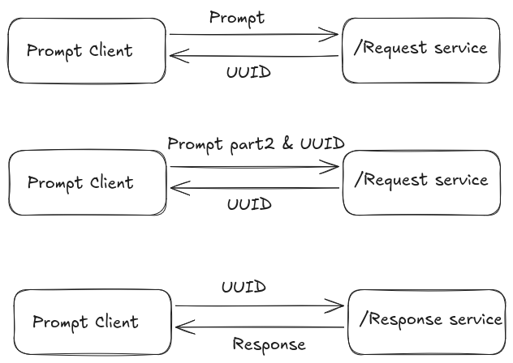

# Service Interface: `prompt/prompt`

The main service interface for sending prompts and receiving responses is `prompt/prompt`, using the [Prompt.srv](../prompt_msgs/srv/Prompt.srv) definition. `prompt_bridge` can load multiple prompt providers concurrently and dispatch each request by `model_family`.



## Service Definition

```
string uuid
prompt_msgs/Prompt prompt
---
string uuid
prompt_msgs/PromptResponse response
```

### Request Fields
| Field         | Type                    | Description                                                                 |
|-------------- |------------------------|-----------------------------------------------------------------------------|
| `uuid`        | string                  | (Optional) Conversation/session ID. Use empty string for new prompt/session. |
| `prompt`      | [Prompt](../prompt_msgs/msg/Prompt.msg) | The prompt message and options.                                              |


#### Prompt.msg Fields
| Field            | Type      | Description                                                                 |
|------------------|-----------|-----------------------------------------------------------------------------|
| `prompt`         | string    | The prompt text to send.                                                    |
| `use_cache`      | bool      | Whether to cache this prompt (for multi-turn or multi-input).               |
| `flush_cache`    | bool      | Whether to flush the cache and process all cached prompts.                  |
| `use_chat_mode`  | bool      | Enable chat/conversational mode (tracks dialogue history).                  |
| `model_family`   | string    | Which model family/provider to use (e.g., `openai`, `ollama`).              |
| `options`        | [ModelOption[]](../prompt_msgs/msg/ModelOption.msg) | Additional model-specific options (e.g., temperature, model name).          |

#### ModelOption.msg Fields
| Field   | Type   | Description                        |
|---------|--------|------------------------------------|
| `key`   | string | Option key                         |
| `value` | string | Option value                       |
| `type`  | string | Type hint. The message constants currently define `str`, `bool`, `int`, and `real`. |

### Response Fields
| Field         | Type                    | Description                                                                 |
|---------------|------------------------|-----------------------------------------------------------------------------|
| `uuid`        | string                  | The session or cache ID returned by `prompt_bridge`.                        |
| `response`    | [PromptResponse](../prompt_msgs/msg/PromptResponse.msg) | The response message.                   |

#### PromptResponse.msg Fields
| Field         | Type      | Description                                                                 |
|---------------|-----------|-----------------------------------------------------------------------------|
| `response`    | string    | The generated response text.                                                |
| `buffered`    | bool      | True if the response is buffered (not final, e.g., when caching).           |
| `success`     | bool      | True if the prompt was processed successfully.                              |
| `accuracy`    | float64   | (Optional) Accuracy metric (if provided by model).                          |
| `confidence`  | float64   | (Optional) Confidence metric.                                               |
| `risk`        | float64   | (Optional) Risk metric.                                                     |

## How to Use the Service



### 1. Single prompt (stateless)
- Set `uuid` to empty string.
- Set `use_cache` and `use_chat_mode` to `false` in the prompt.
- The response is processed immediately.
- The returned `uuid` is empty.

### 2. Chat mode (multi-turn conversation)
- Set `use_chat_mode` to `true` in the prompt.
- For a new conversation, set `uuid` to empty string. The response will include a new `uuid` for the session.
- For follow-up prompts, set `uuid` to the previous response's `uuid` to continue the conversation.
- When `use_cache` is `false`, each request is sent immediately and both user and assistant turns are appended to the stored conversation.

### 3. Prompt caching
- In chat mode, `use_cache=true` and `flush_cache=false` buffers the prompt and returns `response.buffered=true` with a `uuid`.
- In chat mode, `use_cache=true` and `flush_cache=true` sends the current prompt together with the stored conversation and returns the same `uuid`.
- In non-chat mode, `use_cache=true` and `flush_cache=false` aggregates user text under a generated `uuid`.
- In non-chat mode, `use_cache=true` and `flush_cache=true` processes the aggregated cache and intentionally clears the returned `uuid` because the request is treated as a one-shot prompt after flush.

### 4. Model selection and options
- Set `model_family` to select the provider/plugin (e.g., `openai`, `ollama`).
- Use the `options` array to specify model-specific parameters (see [plugin_parameters.md](plugin_parameters.md)).

## Example Request (YAML)

```yaml
uuid: ""
prompt:
  prompt: "What is the capital of France?"
  use_cache: false
  flush_cache: false
  use_chat_mode: false
  model_family: "openai"
  options:
    - key: model
      value: gpt-5
      type: str
```

## Extending

To add a new Online Prompt provider, implement a plugin inheriting from `prompt::PromptBaseClass` and register it. Add its configuration to your YAML file and list it in `prompt_family_names` and `prompt_family_plugins`.


## Notes
- The service is designed to support both stateless and conversational (chat) interactions.
- Use the `uuid` field to manage sessions for chat or caching.
- `response.buffered` is set by `prompt_bridge` to indicate whether the request was buffered instead of sent to the provider.
- New chat conversations always receive a generated `uuid`, even when the first request is processed immediately.
